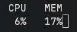

# Resomoni
Simple **Reso**urce **moni**tor for Linux written in Rust.



## Setup
To compile the project, run:
```bash
cargo build --release
```
Binary file will be located in `target/release` directory.

## License
This project is licensed under [MIT License](./LICENSE).
